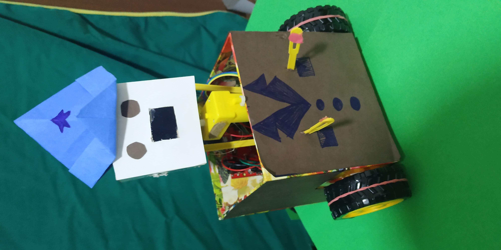
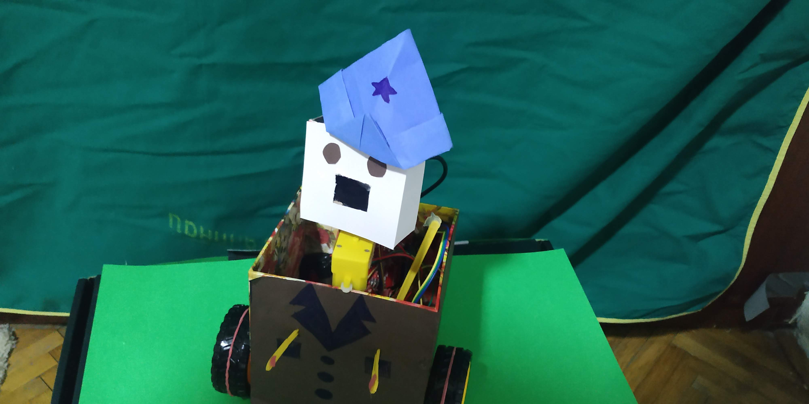

A description of your concept and how it was achieved
One or more photographs of your project
Major problems, if any, and solutions, if any
Clever or difficult things about your project
A link to the video

## Description:
For my final project a made a music video performance of a soviet era World War 2 song, in which the main performer was a robot. The song is about a young accordion player that 
goes to war to win a medal in order to impress the girl he loves, and he succeeds in achieving that. The performance visually shows the story of the song, syncronized with the singing 
in the background.
To achieve this, I created a simple robot that moves using DC motors, can rotate it's head left and right, and has an OLED display which displays a mouth on its face to portray simple 
emotion like happiness and sadness. The videos were shot with a mobile phone camera, and the scene was relatively small (see scene photo below). The chanigng of the scenery and showing 
the location of the robot i.e. a meadow, frontline, starry night, and forrest was done by using a greenscreen fabric behind the scene for easier change of backgrounds. After recording,
the videos were edited using Premiere Pro to stabilize them and change the backgrounds. Since the scene area was small, the videos were shot in multiple shorter scenes.

## Performer:

## Scene:

## Problems and issues (this is documented in the journal, but also here for your convenience):
"One of the main and earliest issues was regarding a stepper motor which I wanted to use. I had the idea to use a stepper motor to turn the robot's head left and right, because stepper motors are much more precise than DC motors, and some form of precision was needed to turn the head properly. However, the main issue is that I was using l298n motor driver, and more power than I could supply was needed. Because of this, I decided to remove the stepper motor from my build and use an ordinary DC motor for the rotation of the head. Ideally, a servo motor would work great, however, I do not have any servo motors at this time.

Another issue that I am facing with the DC motors is the fact that their impreciseness affects the way the robot is moving. During the recording of some sceenes, multiple shots are taken, because the motors do not always act the same way, and the movement of the robot is different every time. Because of the very small sceene area that I am using, this affects the quality of the footage.

While editing the first couple of scenes, I noticed that the green screen fabric that I am using is imperfect, and that shadows caused by improper lighting and creases on the fabric make it impossible to use it as a good green screen. Therefore I ironed the fabric, added much more light by using desklamps, and reshot the first scenes. This improved the greenscreen effect by a lot."

Additionaly, this was not a problem, but just an interesting experience. I could not find a nice mouth animation for the OLED display, so I used hand-drawn images which I drew previously during the course using a simple pen, I then made each image to be a single frame, conveted it to BMP format, got the code for it and included it in my arduino code.

## The video:
[Video](https://www.youtube.com/watch?v=9ueoluVZ928)
