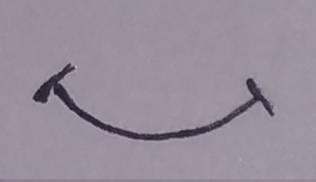
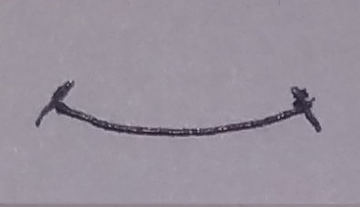
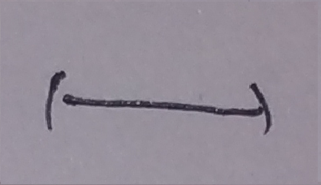
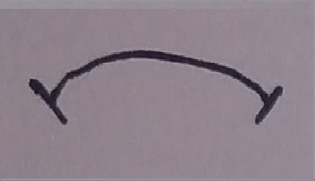

# Robot Facial Expresions Sprites

### The sprites that I plan to animate for my robot are it's facial expresions. Those will be done by animating the movement of the mouth and eyes.

## Mouth Sprites:

## Eyes Sprites:

### If the robot is confused (something is loading), these three questionmarks should appear one by one from left to right then from right to left untill the robot is no longer confused.

