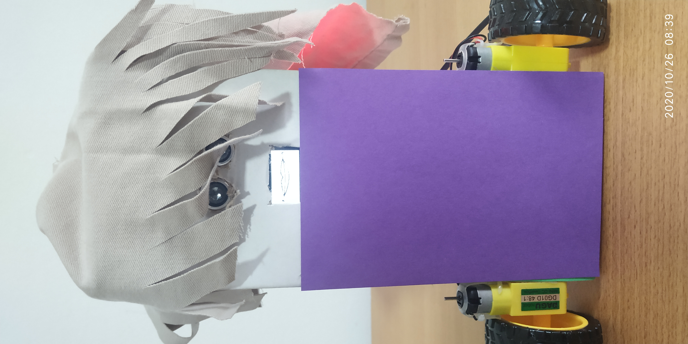

# Shakespeare Robot

## The scene that I chose to recreate with my robot is the death of Duncan in Macbeth.
I am intending to record the scene mostly with close face shots. The characters that move in the scene will all be played by the same robot, dressed in different costumes to represent different characters (Macbeth, Lady, Duncan). Other characters such as the guards will be static, and they will be represented by other props. The secene will last for around one minute.

## How the video was made.
The video was recorded using a mobile phone camera. The actors of this video are Mikey the robot and a Christmas tree decoration ball. Mikey represents two characters. The first one is Macbeth and the second is Lady Macbeth. The portrayal of the two different characters was achieved by changing costumes. (i.e. adding hair made from textile, adding and arm and a knife, changing the color of the front side of the body.) For King Duncan, I used a Christmas ball for a head with a crown made from hard paper. The bed is a cardboard box covered by textile to represent the bedding. The blood was made from red powdered food coloring, and was injected below the knife during the recording of the scene.
Since the robots were acting and multiple scenes were taken, a single arduino code was very impractical. Therefore, I made a core code and then changed certain lines and values so that the robots would be able to act out a single scene at a time. The code uploaded on this page is from the final recorded scene: the dialogue of Lady Macbeth. The background music of the video was not made by me, but was downloaded from a royalty free source.

## The best part: [The Video](https://www.youtube.com/watch?v=4JmbkYKBxAc)

